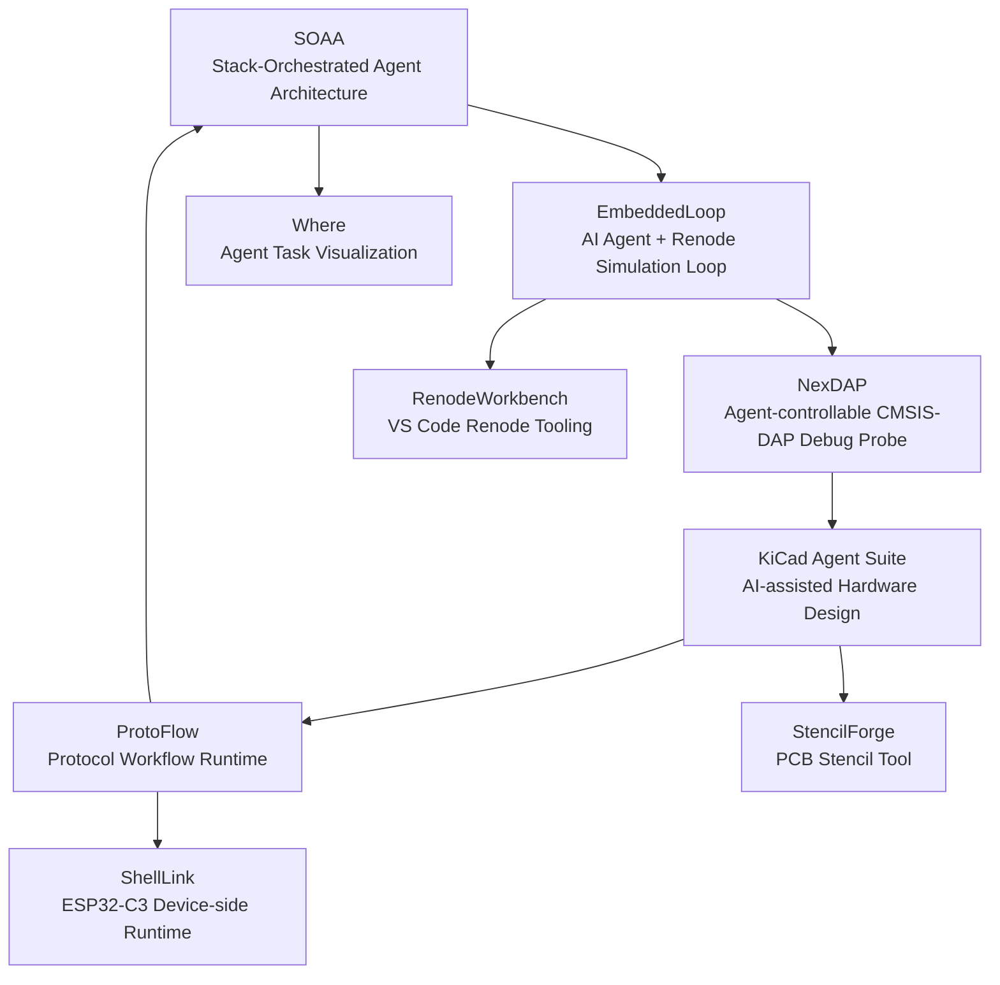

# AI-Native Embedded Development Loop

> 嵌入式 + AI Agent 驱动的软硬件开发闭环  
> An AI-agent-driven embedded software and hardware development loop.

Language: English | [简体中文](README.zh-CN.md)

## Overview

This repository is a project hub for an AI-native embedded development workflow.

The goal is to make AI agents participate in the real embedded engineering loop, not only code generation.

The loop covers:

1. Agent orchestration
2. Embedded software simulation
3. Real hardware debugging
4. Hardware design automation
5. Protocol testing
6. Developer tooling and visualization

## Quick Links

- [SOAA — Stack-Orchestrated Agent Architecture](https://github.com/11cookies11/Stack-Orchestrated-Agent-Architecture)
- [EmbeddedLoop — AI Agent + Renode Embedded Software Loop](https://github.com/11cookies11/EmbeddedLoopDemo)
- [NexDAP — Agent-controllable CMSIS-DAP Debug Probe](https://github.com/11cookies11/NexDAP)
- [KiCad Agent Suite — AI-assisted Hardware Design Toolchain](https://github.com/11cookies11/kicad-agent-suite)
- [ProtoFlow — Embedded Protocol Workflow Runtime](https://github.com/11cookies11/ProtoFlow)
- [RenodeWorkbench — VS Code Renode Tooling](https://github.com/11cookies11/RenodeWorkbench)
- [ShellLink — ESP32-C3 Device-side Runtime](https://github.com/11cookies11/ShellLink)
- [Where — Agent Task Visualization](https://github.com/11cookies11/Where)
- [StencilForge — PCB Stencil Tool](https://github.com/11cookies11/StencilForge)

## Architecture



## Core Idea

Traditional embedded development often relies on fragmented tools:

- IDE / editor
- build scripts
- serial terminal
- debugger
- oscilloscope / logic analyzer
- PCB CAD tools
- test scripts
- manual notes

This project explores a different model:

> Deterministic engineering steps are executed by programs; uncertain decisions are delegated to AI agents; all intermediate states are structured, observable, recoverable, and testable.

## Project Map

| Layer | Project | Role | Repository |
|---|---|---|---|
| Agent Orchestration | SOAA | Stack-based task orchestration for deterministic program + AI agent collaboration | [GitHub](https://github.com/11cookies11/Stack-Orchestrated-Agent-Architecture) |
| Software Simulation Loop | EmbeddedLoop | Renode-based closed-loop embedded software development and verification | [GitHub](https://github.com/11cookies11/EmbeddedLoopDemo) |
| Real Hardware Loop | NexDAP | Agent-controllable CMSIS-DAP debug probe based on RP2040 + ESP32-C3 | [GitHub](https://github.com/11cookies11/NexDAP) |
| Hardware Design Automation | KiCad Agent Suite | Structured hardware design workflow driven by `circuit-model.json` | [GitHub](https://github.com/11cookies11/kicad-agent-suite) |
| Protocol Testing | ProtoFlow | YAML DSL + state-machine runtime for UART / TCP / Modbus / XMODEM workflows | [GitHub](https://github.com/11cookies11/ProtoFlow) |
| Simulation Tooling | RenodeWorkbench | VS Code extension for local / remote Renode sessions and GDB attach | [GitHub](https://github.com/11cookies11/RenodeWorkbench) |
| Device-side Runtime | ShellLink | ESP32-C3 remote shell and lightweight DSL runtime | [GitHub](https://github.com/11cookies11/ShellLink) |
| Agent Visualization | Where | VS Code extension for visualizing agent task progress from Markdown | [GitHub](https://github.com/11cookies11/Where) |
| PCB Manufacturing Tool | StencilForge | Gerber / Excellon to 3D-printable stencil STL tool | [GitHub](https://github.com/11cookies11/StencilForge) |

## Core Projects

### SOAA — Stack-Orchestrated Agent Architecture

Repository: [11cookies11/Stack-Orchestrated-Agent-Architecture](https://github.com/11cookies11/Stack-Orchestrated-Agent-Architecture)

SOAA is the orchestration layer of the entire system. It separates deterministic program execution from AI-agent decision points.

Responsibilities:

- Stack-based task management
- Parent / child task nesting
- Structured JSON task handoff
- Context persistence
- Failure recovery
- CLI-first agent interface

### EmbeddedLoop — AI Agent + Renode Embedded Software Loop

Repository: [11cookies11/EmbeddedLoopDemo](https://github.com/11cookies11/EmbeddedLoopDemo)

EmbeddedLoop proves that AI agents can participate in a full embedded software development loop in simulation.

Loop:

```text
generate code -> build firmware -> run in Renode -> inspect logs -> debug -> fix -> validate again
```

Covered scenarios include bare-metal, FreeRTOS, Zephyr, multiple MCUs, and multi-node communication.

### NexDAP — Agent-controllable CMSIS-DAP Debug Probe

Repository: [11cookies11/NexDAP](https://github.com/11cookies11/NexDAP)

NexDAP extends the loop from simulation to real hardware.

Architecture:

- RP2040 as SWD / DAP core
- ESP32-C3 as hosting, control, and communication layer
- Target capability: SWD access, flashing, status reading, remote control, automated validation

### KiCad Agent Suite — AI-assisted Hardware Design Toolchain

Repository: [11cookies11/kicad-agent-suite](https://github.com/11cookies11/kicad-agent-suite)

KiCad Agent Suite turns hardware design into a structured, agent-readable workflow.

Core concept:

- `circuit-model.json` as the intermediate representation
- requirement modeling
- component selection
- power-tree planning
- interface planning
- pinmux
- schematic module decomposition
- PCB constraints
- bring-up documentation

### ProtoFlow — Embedded Protocol Workflow Runtime

Repository: [11cookies11/ProtoFlow](https://github.com/11cookies11/ProtoFlow)

ProtoFlow converts manual serial / protocol testing into executable protocol workflows.

It uses:

- YAML DSL
- state-machine executor
- driver abstraction
- timeout / retry / condition jump
- CRC validation
- UART / TCP / Modbus RTU / XMODEM support

## Supporting Tools

### StencilForge

Repository: [11cookies11/StencilForge](https://github.com/11cookies11/StencilForge)

A desktop tool for converting PCB Gerber / Excellon files into 3D-printable stencil and fixture STL models.

### RenodeWorkbench

Repository: [11cookies11/RenodeWorkbench](https://github.com/11cookies11/RenodeWorkbench)

A VS Code extension for managing local or remote Renode sessions, firmware sync, GDB attach, UART log testing, and diagnostics.

### ShellLink

Repository: [11cookies11/ShellLink](https://github.com/11cookies11/ShellLink)

An ESP32-C3 remote shell and device-side DSL runtime for automated protocol testing.

### Where

Repository: [11cookies11/Where](https://github.com/11cookies11/Where)

A VS Code extension that visualizes AI-agent task progress from Markdown files.

## Resume Summary

Embedded software engineer with industrial stepper drive development experience, covering multi-axis real-time control, Modbus / EtherCAT communication, MCU platform migration, bootloader, and field debugging.

Currently building an AI-native embedded development loop that connects software simulation, real hardware debugging, hardware design automation, protocol testing, and stack-based agent orchestration.

## 中文简介

具备工业级步进驱动器嵌入式软件开发经验，熟悉多轴实时控制、Modbus / EtherCAT 工业通信、多平台 MCU 底层开发、Bootloader 和现场问题攻关。

当前正在构建 AI Agent 驱动的嵌入式软硬件开发闭环，覆盖软件仿真、真实硬件调试、硬件设计自动化、通信协议测试与任务编排架构。

## Repository Purpose

This repository is not a single implementation repository.  
It is the public overview and index repository for the AI-native embedded development loop.

Use it as:

- GitHub profile pinned project
- resume project hub
- interview entry point
- roadmap tracker
- architecture documentation center
