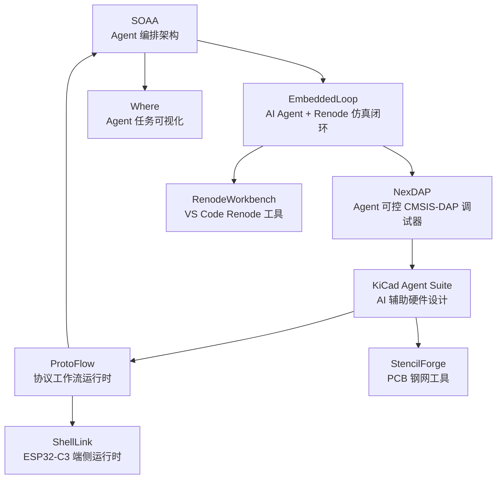

# AI-Native Embedded Development Loop

> 嵌入式 + AI Agent 驱动的软硬件开发闭环

语言：简体中文 | [English](README.md)

## 概览

本仓库是 AI-Native 嵌入式开发工作流的总览与导航中心。

核心目标：让 AI Agent 不只是生成代码，而是真正参与嵌入式工程闭环。

闭环覆盖：

1. Agent 任务编排
2. 嵌入式软件仿真验证
3. 真实硬件调试闭环
4. 硬件设计自动化
5. 通信协议自动化测试
6. 开发工具链与可视化

## 快速链接

- [SOAA — Stack-Orchestrated Agent Architecture](https://github.com/11cookies11/Stack-Orchestrated-Agent-Architecture)
- [EmbeddedLoop — AI Agent + Renode 嵌入式软件闭环](https://github.com/11cookies11/EmbeddedLoopDemo)
- [NexDAP — Agent 可控的 CMSIS-DAP 调试器](https://github.com/11cookies11/NexDAP)
- [KiCad Agent Suite — AI 辅助硬件设计工具链](https://github.com/11cookies11/kicad-agent-suite)
- [ProtoFlow — 嵌入式协议工作流运行时](https://github.com/11cookies11/ProtoFlow)
- [RenodeWorkbench — VS Code Renode 工具](https://github.com/11cookies11/RenodeWorkbench)
- [ShellLink — ESP32-C3 端侧运行时](https://github.com/11cookies11/ShellLink)
- [Where — Agent 任务可视化](https://github.com/11cookies11/Where)
- [StencilForge — PCB 钢网工具](https://github.com/11cookies11/StencilForge)

## 架构



## 核心理念

传统嵌入式开发依赖大量零散工具：IDE、编译脚本、串口终端、调试器、示波器、PCB CAD、测试脚本、手工笔记……

本项目探索一种不同的模式：

> 确定性工程步骤交给程序执行；不确定性决策委托给 AI Agent；所有中间状态结构化、可观测、可恢复、可测试。

## 项目地图

| 层次 | 项目 | 定位 | 仓库 |
|---|---|---|---|
| Agent 编排 | SOAA | 确定性程序 + AI Agent 协作的栈式任务编排 | [GitHub](https://github.com/11cookies11/Stack-Orchestrated-Agent-Architecture) |
| 软件仿真闭环 | EmbeddedLoop | 基于 Renode 的嵌入式软件开发与验证闭环 | [GitHub](https://github.com/11cookies11/EmbeddedLoopDemo) |
| 真实硬件闭环 | NexDAP | 基于 RP2040 + ESP32-C3 的 Agent 可控 CMSIS-DAP 调试器 | [GitHub](https://github.com/11cookies11/NexDAP) |
| 硬件设计自动化 | KiCad Agent Suite | 基于 `circuit-model.json` 的结构化硬件设计工作流 | [GitHub](https://github.com/11cookies11/kicad-agent-suite) |
| 协议测试 | ProtoFlow | YAML DSL + 状态机运行时，支持 UART / TCP / Modbus / XMODEM | [GitHub](https://github.com/11cookies11/ProtoFlow) |
| 仿真工具 | RenodeWorkbench | VS Code 扩展，管理本地/远程 Renode 会话与 GDB 调试 | [GitHub](https://github.com/11cookies11/RenodeWorkbench) |
| 端侧运行时 | ShellLink | ESP32-C3 远程 Shell 与轻量 DSL 运行时 | [GitHub](https://github.com/11cookies11/ShellLink) |
| Agent 可视化 | Where | VS Code 扩展，从 Markdown 解析 Agent 任务进度并可视化 | [GitHub](https://github.com/11cookies11/Where) |
| PCB 制造工具 | StencilForge | Gerber / Excellon 转 3D 打印钢网 STL 工具 | [GitHub](https://github.com/11cookies11/StencilForge) |

## 核心项目

### SOAA — Stack-Orchestrated Agent Architecture

仓库：[11cookies11/Stack-Orchestrated-Agent-Architecture](https://github.com/11cookies11/Stack-Orchestrated-Agent-Architecture)

SOAA 是整个系统的编排层，将确定性程序执行与 AI Agent 决策点分离。

职责：

- 栈式任务管理
- 父子任务嵌套
- 结构化 JSON 任务交接
- 上下文持久化
- 故障恢复
- CLI-first Agent 接口

### EmbeddedLoop — AI Agent + Renode 嵌入式软件闭环

仓库：[11cookies11/EmbeddedLoopDemo](https://github.com/11cookies11/EmbeddedLoopDemo)

EmbeddedLoop 验证了 AI Agent 可以在仿真中完成完整的嵌入式软件开发闭环。

闭环：

```text
生成代码 -> 构建固件 -> Renode 仿真运行 -> 日志检查 -> 调试 -> 修复 -> 再次验证
```

覆盖场景：bare-metal、FreeRTOS、Zephyr、多 MCU、多节点通信。

### NexDAP — Agent 可控的 CMSIS-DAP 调试器

仓库：[11cookies11/NexDAP](https://github.com/11cookies11/NexDAP)

NexDAP 将闭环从仿真延伸到真实硬件。

架构：

- RP2040 作为 SWD / DAP 核心
- ESP32-C3 作为宿主、控制与通信层
- 目标能力：SWD 访问、烧录、状态读取、远程控制、自动化验证

### KiCad Agent Suite — AI 辅助硬件设计工具链

仓库：[11cookies11/kicad-agent-suite](https://github.com/11cookies11/kicad-agent-suite)

KiCad Agent Suite 将硬件设计转化为结构化、Agent 可读的工作流。

核心概念：

- `circuit-model.json` 作为硬件中间表示
- 需求建模
- 器件选型
- 电源树规划
- 接口规划
- Pinmux
- 原理图模块分解
- PCB 约束
- Bring-up 文档

### ProtoFlow — 嵌入式协议工作流运行时

仓库：[11cookies11/ProtoFlow](https://github.com/11cookies11/ProtoFlow)

ProtoFlow 将手工串口/协议测试转化为可执行的协议工作流。

技术栈：

- YAML DSL
- 状态机执行器
- 驱动抽象
- 超时/重试/条件跳转
- CRC 校验
- UART / TCP / Modbus RTU / XMODEM 支持

## 辅助工具

### StencilForge

仓库：[11cookies11/StencilForge](https://github.com/11cookies11/StencilForge)

将 PCB Gerber / Excellon 文件转换为 3D 打印钢网和夹具 STL 模型的桌面工具。

### RenodeWorkbench

仓库：[11cookies11/RenodeWorkbench](https://github.com/11cookies11/RenodeWorkbench)

VS Code 扩展，管理本地或远程 Renode 会话、固件同步、GDB 连接、UART 日志测试和诊断。

### ShellLink

仓库：[11cookies11/ShellLink](https://github.com/11cookies11/ShellLink)

ESP32-C3 远程 Shell 和端侧 DSL 运行时，用于自动化协议测试。

### Where

仓库：[11cookies11/Where](https://github.com/11cookies11/Where)

VS Code 扩展，从 Markdown 文件可视化 AI Agent 任务进度。

## 简历摘要

具备工业级步进驱动器嵌入式软件开发经验，熟悉多轴实时控制、Modbus / EtherCAT 工业通信、多平台 MCU 底层开发、Bootloader 和现场问题攻关。

当前正在构建 AI Agent 驱动的嵌入式软硬件开发闭环，覆盖软件仿真、真实硬件调试、硬件设计自动化、通信协议测试与任务编排架构。

## 仓库定位

本仓库不是单一功能实现仓库，而是 AI-Native 嵌入式开发闭环的公开总览与索引仓库。

用途：

- GitHub Profile 置顶项目
- 简历项目入口
- 面试展示中心
- 路线图跟踪
- 架构文档中心
