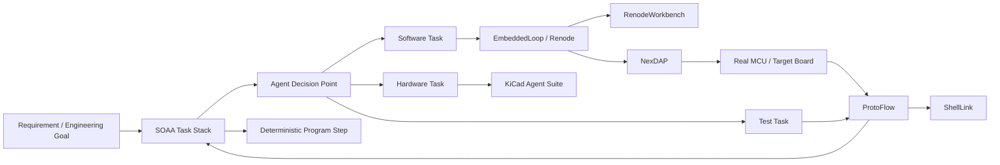

# Architecture

## AI-Native Embedded Development Loop

## Layers

### 1. Orchestration Layer

Project: [SOAA](https://github.com/11cookies11/Stack-Orchestrated-Agent-Architecture)

Purpose:

- Convert complex engineering processes into resumable task stacks.
- Separate deterministic program execution from AI decision points.
- Preserve context as files.
- Allow humans, agents, and tools to cooperate.

### 2. Software Simulation Layer

Project: [EmbeddedLoop](https://github.com/11cookies11/EmbeddedLoopDemo)

Purpose:

- Build and test embedded firmware in Renode.
- Support AI-agent code iteration.
- Provide logs, GDB checks, and automated validation.

### 3. Real Hardware Debug Layer

Project: [NexDAP](https://github.com/11cookies11/NexDAP)

Purpose:

- Connect AI-agent workflows to real MCU targets.
- Provide flashing, SWD access, state reading, and remote debug control.

### 4. Hardware Design Layer

Project: [KiCad Agent Suite](https://github.com/11cookies11/kicad-agent-suite)

Purpose:

- Convert hardware requirements into structured models.
- Generate design documentation, schematics, and PCB constraints.
- Make hardware design agent-readable and traceable.

### 5. Protocol Test Layer

Project: [ProtoFlow](https://github.com/11cookies11/ProtoFlow)

Purpose:

- Turn UART / TCP / Modbus / XMODEM interactions into executable workflows.
- Provide repeatable communication validation for agents.

### 6. Tooling Layer

Projects:

- [RenodeWorkbench](https://github.com/11cookies11/RenodeWorkbench)
- [ShellLink](https://github.com/11cookies11/ShellLink)
- [Where](https://github.com/11cookies11/Where)
- [StencilForge](https://github.com/11cookies11/StencilForge)

Purpose:

- Improve visibility, developer experience, and workflow automation.
